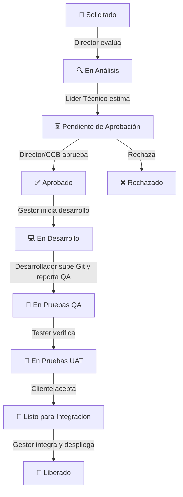

# 🚀 GestioCambios G04 - Sistema SCM Multi-Proyecto

Este proyecto es un **Sistema de Gestión de la Configuración del Software (SCM)** premium diseñado para controlar, rastrear, planificar y aprobar los cambios en el ciclo de vida del desarrollo de software. Está estructurado bajo un enfoque **multi-proyecto**, donde cada proyecto cuenta con su propia configuración de **metodología**, **cronograma** y asignación de **equipo con roles dinámicos**.

---

## 🛠️ Tecnologías y Arquitectura

El sistema está construido bajo el patrón arquitectónico **MVC (Modelo-Vista-Controlador)** clásico renderizado desde el servidor:

*   **Backend:** [Node.js](https://nodejs.org/) con [Express.js](https://expressjs.com/).
*   **Motor de Plantillas:** [EJS (Embedded JavaScript)](https://ejs.co/), inyectando datos y lógica directamente antes de servir el HTML.
*   **Base de Datos:** MySQL / MariaDB (utilizando la librería nativa asíncrona `mysql2/promise`).
*   **Diseño Visual:** CSS vainilla moderno (`public/css/styles.css`) con diseño oscuro premium (*Dark Mode*), tarjetas con efecto *glassmorphic* (filtro de desenfoque de fondo), animaciones de entrada fluidas y componentes de UI altamente responsivos inspirados en la estética moderna de Shadcn/UI.

---

## 👥 Estructura de Roles del Sistema

El sistema maneja dos capas de roles: **Roles Globales** (para control de accesos generales) y **Roles del Proyecto** (definidos de forma independiente en cada proyecto).

### 1. Administrador (Global)
*   **Función:** Tiene control total del sistema.
*   **Permisos:** Crea y edita proyectos, gestiona usuarios globales, crea/modifica metodologías de trabajo, define equipos de desarrollo y asigna los clientes respectivos a cada proyecto.

### 2. Solicitante (Cliente / Docente Evaluador)
*   **Función:** Dueño del producto o validador académico.
*   **Permisos:** Visualiza su cartera de proyectos asignados, consulta el avance en tiempo real, lee reportes de progreso y crea **Solicitudes de Cambio (Tickets)** asociadas a los entregables específicos del cronograma.

### 3. Director
*   **Función:** Aprobador de negocio de alto nivel.
*   **Permisos:** Analiza viabilidad inicial de cambios, aprueba/rechaza tickets en fases previas, monitorea estadísticas globales de todos los proyectos activos y visualiza reportes consolidados.

### 4. Líder Técnico
*   **Función:** Responsable de la planificación técnica y arquitectura.
*   **Permisos:** Crea, edita y elimina actividades del cronograma de un proyecto, realiza análisis de impacto técnico y estimación de horas hombre, y promueve los tickets a aprobación del CCB/Director.

### 5. Gestor de Configuración (CM)
*   **Función:** Guardián del Repositorio y Entregables.
*   **Permisos:** Define los Elementos de Configuración de Software (ECM), aprueba el paso a desarrollo, realiza integraciones de código y ejecuta la **Liberación** definitiva de los tickets aprobados.

### 6. Comité de Control de Cambios (CCB)
*   **Función:** Órgano colegiado de decisión técnica y de negocio.
*   **Permisos:** Revisa los análisis de impacto y aprueba o rechaza de manera formal los cambios antes de que entren a la etapa de desarrollo.

### 7. Desarrollador Asignado
*   **Función:** Constructor del software.
*   **Permisos:** Recibe tickets aprobados, realiza los cambios en el código, sube evidencias (ramas de Git / Pull Requests) y reporta el porcentaje de avance de las actividades del cronograma.

### 8. Equipo QA / Tester
*   **Función:** Aseguramiento de la Calidad.
*   **Permisos:** Realiza las pruebas de control de calidad sobre los desarrollos de los tickets, registra observaciones y aprueba el paso a Integración/Liberación.

> [!NOTE]
> **Roles por Proyecto:** El sistema soporta que un usuario tenga **diferentes roles en diferentes proyectos**. Por ejemplo, *Diego* puede ser "Líder Técnico" en el Proyecto A, y figurar como "Desarrollador Asignado" en el Proyecto B.

---

## 🔄 Flujo del Sistema (Workflow SCM)

El ciclo de vida de una **Solicitud de Cambio (Ticket)** sigue la siguiente máquina de estados:



### Vinculación de Tickets con el Cronograma
Las solicitudes de cambio no se crean al aire: **se vinculan a un entregable (ECM) de una actividad del cronograma de un proyecto**. De esta manera, si un cliente solicita modificar un módulo de registro, el cambio queda registrado afectando la actividad de diseño o código de esa fase específica, permitiendo un rastreo total (Trazabilidad SCM).

---

## 📐 Estructura de la Metodología SCM

Cada proyecto se rige por una **Metodología** que contiene una jerarquía de control de configuración:

1.  **Metodología** (Ej: *RUP* o *Scrum*).
2.  **Etapas** (Ej: *Iniciación, Elaboración, Construcción, Transición*).
3.  **Fases** dentro de cada etapa (Ej: *Concepción, Arquitectura, Desarrollo, Estabilización*).
4.  **Elementos de Configuración del Software (ECM)**: Los entregables obligatorios que genera cada fase, clasificados en:
    *   `Documento` (Ej: SRS, SAD, Manual de Usuario).
    *   `Diagrama` (Ej: Diagrama de Clases, Casos de Uso, Secuencias).
    *   `Codigo` (Ej: Código Fuente).
    *   `Prueba` (Ej: Plan de Pruebas Unitarias).
    *   `Otro` (Cualquier otro entregable).

---

## 🗄️ Modelo de Base de Datos (Tablas Clave)

*   `proyectos`: Información general, fechas y metodología del proyecto.
*   `proyecto_equipo` / `proyecto_clientes`: Mapea la asignación de usuarios y sus roles específicos dentro de cada proyecto.
*   `metodologias`, `etapas`, `fases`, `elementos_config_metodologia`: Definición del árbol estructural del marco de trabajo.
*   `cronograma_actividades`: Actividades temporales de cada proyecto, vinculadas a una fase metodológica y a un ticket de entregable.
*   `reportes_avance`: Registro histórico de avances porcentuales de las actividades para el cálculo del ranking y progreso general.
*   `solicitudes_cambio`: Tabla SCM de tickets de cambio vinculada a un proyecto y solicitante.
*   `historial_estados`: Auditoría de transiciones de estados del ticket (Graba: usuario, fecha, comentario, estado anterior y nuevo).

---

## 🏃‍♂️ Instalación y Puesta en Marcha

### 1. Instalar dependencias
Asegúrate de estar en el directorio raíz del proyecto y ejecuta:
```bash
npm install
```

### 2. Configurar variables de entorno
Crea un archivo `.env` en la raíz del proyecto y agrega tus credenciales de base de datos (por defecto viene configurado con la base de datos remota de Filess.io del equipo):
```env
DB_HOST=be2wna.h.filess.io
DB_PORT=3305
DB_USER=Gestion_de_Cambios_catshelook
DB_PASSWORD=e0e7dd41fde09f1afe5852af4ec6c8bbea90b0d1
DB_NAME=Gestion_de_Cambios_catshelook
PORT=3000
```

### 3. Poblar la Base de Datos (Semilla/Seed)
Hemos creado un script que borra de forma segura proyectos y metodologías de prueba previos, e inserta las metodologías **RUP** y **Scrum** completas con todas sus etapas/fases/ECMs, un proyecto demo llamado **ZOFRA TACNA** con equipo asignado, cronograma y clientes listos para interactuar. Ejecuta:
```bash
node seed.js
```

### 4. Arrancar el Servidor
Inicia el servidor local de desarrollo:
```bash
npm start
```
Abre en tu navegador [http://localhost:3000](http://localhost:3000) para acceder al sistema.

---

## 🔑 Credenciales de Demostración (Contraseña general: `123`)

En la pantalla de Login cuentas con botones de acceso rápido para probar la plataforma desde la perspectiva de cada rol:

1.  **Solicitante (Cliente):** `docente@upt.pe`
2.  **Director:** `director@upt.pe`
3.  **Gestor de Configuración:** `sergio@upt.pe`
4.  **Líder Técnico:** `diego@upt.pe`
5.  **Comité CCB:** `ccb@upt.pe`
6.  **Desarrollador Asignado:** `gregory@upt.pe`
7.  **Tester / QA:** `cesar@upt.pe`
8.  **Administrador Global:** `admin@upt.pe`
