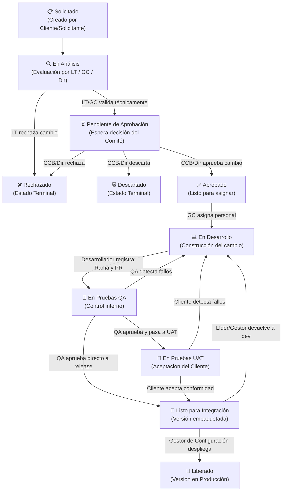

# 🚀 GestioCambios G04 — Sistema de Gestión de Cambios SCM

> **Proyecto académico** desarrollado por el Grupo 04 de la Universidad Privada de Tacna (UPT).  
> Sistema web full-stack para el control, trazabilidad y aprobación de cambios en proyectos de software, siguiendo las buenas prácticas del **Software Configuration Management (SCM)**.

---

## 📌 ¿Qué es este sistema?

**GestioCambios** es una plataforma web de gestión del ciclo de vida de cambios de software. Permite que un equipo de desarrollo registre, evalúe, apruebe, implemente y libere solicitudes de cambio sobre proyectos de software reales, con trazabilidad completa en cada paso del proceso.

El sistema es **multi-proyecto**: cada proyecto puede tener su propia metodología de trabajo (RUP, Scrum, etc.), su propio equipo con roles específicos, su cronograma de actividades y sus tickets de cambio. Un mismo usuario puede tener **diferentes roles en diferentes proyectos**.

---

## 🛠️ Stack Tecnológico

| Capa | Tecnología | Descripción |
|---|---|---|
| **Runtime** | Node.js v18+ | Motor de ejecución JavaScript del lado del servidor |
| **Framework Web** | Express.js v4 | Enrutamiento HTTP, middlewares y manejo de sesiones |
| **Motor de Vistas** | EJS (Embedded JS) | Renderizado SSR: el servidor inyecta datos en las plantillas HTML antes de servirlas |
| **Base de Datos** | MariaDB / MySQL 5.7+ | Base de datos relacional remota alojada en Filess.io |
| **Driver BD** | mysql2/promise | Conexión async/await nativa con pool de conexiones |
| **Seguridad** | bcryptjs | Hash unidireccional de contraseñas con salt |
| **Sesiones** | express-session | Manejo de sesiones del usuario persistidas 8 horas |
| **CSS** | Vanilla CSS | Diseño dark mode premium, glassmorphism, micro-animaciones |
| **Gráficos** | Chart.js (CDN) | Gráficos de barras y dona en el dashboard del administrador |

**Patrón Arquitectónico:** MVC clásico renderizado en servidor (SSR)
- `models/` → Consultas SQL encapsuladas (acceso a datos)
- `controllers/` → Lógica de negocio y renderizado de vistas
- `services/` → Reglas de negocio complejas (workflow de estados, filtros por rol)
- `views/` → Plantillas EJS (HTML + lógica de presentación)
- `routes/` → Definición de rutas HTTP (web y API)

---

## 📁 Estructura de Carpetas

```
Gestion_de_Cambios/
│
├── config/
│   ├── constants.js          ← Roles, estados, tipos de ECM, flujo de estados del ticket
│   └── db.js                 ← Pool de conexión a MariaDB con testConnection()
│
├── controllers/
│   ├── authController.js     ← Login, logout, middlewares requireAuth y requireAdmin
│   ├── changeController.js   ← Tickets: creación, transiciones de estado, API REST
│   ├── adminController.js    ← Dashboard admin, CRUD proyectos / usuarios / metodologías
│   └── proyectoController.js ← Detalle proyecto, cronograma, reportes de avance
│
├── models/
│   ├── TicketModel.js        ← Solicitudes de cambio (BASE_QUERY con JOINs a usuarios y proyectos)
│   ├── ProyectoModel.js      ← Proyectos, equipo, clientes
│   ├── CronogramaModel.js    ← Actividades, avance, resumen y sincronización con tickets
│   ├── MetodologiaModel.js   ← Árbol completo: metodología > etapas > fases > ECM
│   ├── UserModel.js          ← Usuarios del sistema
│   └── ReporteModel.js       ← Reportes de avance y ranking del equipo
│
├── services/
│   └── WorkflowService.js    ← Reglas de transición, roles permitidos por estado, bandeja dinámica
│
├── routes/
│   ├── webRoutes.js          ← Rutas de vistas HTML (GET /admin, /tickets, /cartera, etc.)
│   └── apiRoutes.js          ← Endpoints REST JSON (POST/PUT/DELETE /api/...)
│
├── views/
│   ├── partials/
│   │   ├── head.ejs          ← DOCTYPE, head, CSS, fuentes Google
│   │   ├── footer.ejs        ← Footer + cierre body/html + script sidebar.js
│   │   └── sidebar.ejs       ← Sidebar adaptativo (menú diferente por cada rol)
│   │
│   ├── admin/
│   │   ├── dashboard.ejs     ← Panel admin con Chart.js (estadísticas globales)
│   │   ├── proyectos.ejs     ← Listado y búsqueda de proyectos
│   │   ├── proyecto-config.ejs ← Config proyecto: 6 tabs (Info, Equipo, Cronograma, Tickets, Metodología, Ranking)
│   │   ├── proyecto-form.ejs ← Formulario crear/editar proyecto
│   │   ├── usuarios.ejs      ← CRUD de usuarios del sistema
│   │   └── metodologias.ejs  ← CRUD árbol metodología con acordeón visual
│   │
│   ├── login.ejs             ← Pantalla de autenticación con botones de demo por rol
│   ├── dashboard.ejs         ← Dashboard equipo técnico (bandeja personalizada por rol)
│   ├── tickets.ejs           ← Listado de tickets con filtros avanzados
│   ├── ticket-detail.ejs     ← Detalle del ticket con stepper de ciclo de vida y acciones
│   ├── nuevo-ticket.ejs      ← Formulario de creación de solicitud de cambio
│   ├── cartera.ejs           ← Mis proyectos asignados (Solicitante + equipo técnico)
│   ├── proyecto-detalle.ejs  ← Vista de detalle del proyecto para el equipo técnico
│   └── reportes-avance.ejs   ← Reportes de avance por actividad y ranking del equipo
│
├── public/
│   ├── css/styles.css        ← Sistema de diseño completo (variables CSS, dark mode, glassmorphism)
│   └── js/sidebar.js         ← Lógica cliente: sidebar toggle, logout, campana de notificaciones
│
├── documentos/               ← Diagramas UML y documentación técnica del proyecto
├── .env                      ← Variables de entorno (DB_HOST, DB_USER, DB_PASSWORD, PORT)
├── server.js                 ← Punto de entrada: configura Express, sesiones, rutas y errores
├── seed.js                   ← Pobla la BD con metodologías RUP/Scrum y proyecto demo
└── package.json
```

---

## 👥 Roles del Sistema

### Roles Globales (asignados al usuario en la base de datos)

| # | Rol | Correo Demo | Descripción |
|---|---|---|---|
| 1 | **Solicitante** | `docente@upt.pe` | Cliente o docente evaluador. Crea tickets y monitorea su estado en la cartera de proyectos. |
| 2 | **Director** | `director@upt.pe` | Aprueba o rechaza tickets en análisis. Visualiza estadísticas globales de todos los proyectos. |
| 3 | **Gestor de Configuración** | `sergio@upt.pe` | Controla el repositorio de entregables (ECM). Aprueba el paso a desarrollo y ejecuta la liberación final. |
| 4 | **Líder Técnico** | `diego@upt.pe` | Gestiona el cronograma, estima impacto técnico y horas hombre. Promueve tickets a CCB. |
| 5 | **Comité CCB** | `ccb@upt.pe` | Aprueba o rechaza formalmente los cambios antes de que entren a la fase de desarrollo. |
| 6 | **Desarrollador Asignado** | `gregory@upt.pe` | Implementa el cambio, sube evidencias Git (rama, PR) y reporta avance del cronograma. |
| 7 | **Equipo QA / Tester** | `cesar@upt.pe` | Realiza pruebas QA/UAT, registra evidencias y aprueba el paso a integración. |
| 8 | **Administrador** | `admin@upt.pe` | Control total del sistema: crea proyectos, gestiona usuarios, metodologías. Ve campana de notificaciones en tiempo real. |

> **Contraseña para todos los usuarios de demo:** `123`

### Roles por Proyecto

Un usuario puede tener un **rol diferente en cada proyecto**. El sistema valida las acciones usando el rol dentro del proyecto, no el rol global. Roles disponibles por proyecto: `Líder Técnico`, `Desarrollador Asignado`, `Equipo QA / Tester`, `Gestor de Configuración`, `Solicitante`, `Director`, `Comité de Control (CCB)`.

---

## 🔄 Flujo del Ciclo de Vida de un Ticket

El proceso de gestión de cambios en **GestioCambios** se rige por un flujo de trabajo (workflow) formal basado en las mejores prácticas de **SCM**. Cada **Solicitud de Cambio (Ticket)** progresa a través de una máquina de estados estricta y segura, donde cada transición es auditada.

### 🗺️ Mapa del Flujo de Trabajo (Mermaid)



---

### 📝 Detalle de los Estados y Transiciones

| Estado | Rol Responsable | Descripción de la Fase | Entregables / Evidencias Requeridas |
| :--- | :--- | :--- | :--- |
| **📋 Solicitado** | **Solicitante (Cliente)** | El usuario final detecta una anomalía o solicita una mejora. Describe el problema y el requisito afectado. | Título, descripción del cambio, tipo, prioridad y vinculación al ECS afectado. |
| **🔍 En Análisis** | **Líder Técnico**, **Gestor**, **Director** | Se evalúa la viabilidad técnica y se determina el impacto sobre la estructura del proyecto. | Estimación inicial en Horas-Hombre y justificación técnica. |
| **⏳ Pendiente de Aprobación** | **Director** / **Comité CCB** | Evaluación de impacto de negocio. Se autoriza formalmente el inicio de las tareas. | Comentario formal de aprobación, rechazo o descarte. |
| **✅ Aprobado** | **Gestor de Configuración** | El ticket ingresa al backlog de desarrollo. Se asigna al programador y al tester QA. | Asignación de `Desarrollador` y `Tester` responsables del ticket. |
| **💻 En Desarrollo** | **Desarrollador Asignado** | El programador asignado implementa los cambios en el código fuente. | Evidencias Git: nombre de la rama y URL del Pull Request (PR) o Merge Request. |
| **🧪 En Pruebas QA** | **Equipo QA / Tester** | Se ejecutan pruebas de caja negra, funcionales y de regresión para validar el entregable. | Estado de QA (`Aprobado`/`Rechazado`), número de tests corridos y observaciones. |
| **👥 En Pruebas UAT** | **Solicitante (Cliente)** | El cliente original prueba el entregable en un entorno de pruebas (Staging) para dar conformidad. | Comentarios de aceptación del usuario o reporte de incidentes (UAT). |
| **🔗 Listo para Integración** | **Líder Técnico** o **Tester** | La versión es congelada (code freeze) y empaquetada. Se prepara el release. | Tag de versión SCM (ej: `v1.1.0`) y auditoría de la rama de integración. |
| **🚀 Liberado** | **Gestor de Configuración** | El cambio se integra a la rama `main` y se despliega en producción. Se da por cerrado el ciclo. | Commit SHA final en GitHub y cierre de auditoría del Elemento de Configuración (ECS). |

---

### 🛡️ Reglas Críticas de Trazabilidad y SCM
* **Validación en Servidor (RBAC)**: Ningún usuario puede saltarse pasos ni realizar cambios de estado que no correspondan a su rol. El backend (`WorkflowService.js`) intercepta y valida cada petición HTTP.
* **Trazabilidad Completa**: Todo cambio de estado crea un registro en `historial_estados`, el cual guarda el estado anterior, el nuevo, el nombre del usuario, su rol y su justificación por escrito. Esto es inmutable.
* **Sincronización Automática con el Cronograma**: A medida que un ticket avanza, el porcentaje de avance de la actividad del cronograma vinculada se actualiza automáticamente (`syncAvanceConTicket`):
  * *En Análisis* → `10%`
  * *En Desarrollo* → `50%`
  * *En Pruebas QA* → `70%`
  * *Liberado* → `100% (Completado)`
  * *Rechazado* → `0% (Bloqueado)`
* **Auditoría de Versiones de ECS**: Cuando el ticket llega al estado `Liberado`, el sistema actualiza automáticamente el historial del Elemento de Configuración del Software (ECS) afectado, registrando al responsable, el commit de Git y la nueva versión lógica de auditoría.
* **Rol del Administrador**: El Administrador **no ejecuta transiciones** — solo visualiza y gestiona la estructura del proyecto.


## 📐 Modelo de Metodología SCM

Cada proyecto usa una metodología que define la jerarquía de sus entregables:

```
Metodología  (Ej: RUP)
  └─ Etapa      (Ej: Iniciación)
       └─ Fase       (Ej: Concepción y Requerimientos)
              └─ ECM - Elemento de Configuración del Software
                   ├─ Tipo: Documento  (Ej: SRS, SAD, Manual de Usuario)
                   ├─ Tipo: Diagrama   (Ej: Casos de Uso, Clases, Secuencia)
                   ├─ Tipo: Codigo     (Ej: Código Fuente)
                   ├─ Tipo: Prueba     (Ej: Plan de Pruebas Unitarias)
                   └─ Tipo: Otro
```

**Metodologías pre-cargadas:**
- **RUP** — 4 etapas: Iniciación → Elaboración → Construcción → Transición
- **Scrum** — 3 etapas: Planificación → Sprints → Cierre de Sprint

---

## 📅 Calendario Mensual e Integración de Entregables

Se ha implementado una interfaz interactiva de **Calendario Mensual** para visualizar de forma intuitiva las actividades del cronograma de cada proyecto:
- **Vista Multi-Perfil**: Disponible tanto en la configuración del administrador (`proyecto-config.ejs`) como en el detalle del proyecto para el equipo técnico y clientes (`proyecto-detalle.ejs`).
- **Navegación Completa**: Permite avanzar o retroceder entre meses o volver al día actual mediante botones de navegación rápida.
- **Trazabilidad de Entregables (ECS)**: Cada celda muestra las tareas con colores según su estado (Completado, En Progreso, Pendiente, Bloqueado). Al hacer clic en un bloque de tarea, se despliega un panel de opciones para consultar detalles, reportar avance o abrir el visor comparador de versiones.
- **Diseño Compacto y Fluido**: Optimizado mediante `minmax(0, 1fr)` en CSS Grid para evitar desbordes horizontales de texto en pantallas pequeñas, forzando a que las tareas muy largas se recorten limpiamente con puntos suspensivos (`...`).
- **Zona Horaria Segura**: Utiliza parseo y formateo local de fechas (`parseLocalDate`) para prevenir desfases de fecha y distorsiones visuales por diferencias horarias (UTC/Local).

## ⚡ Carga Rápida de Datos de Demostración

Para agilizar la configuración inicial y las pruebas locales, se añadieron botones de carga rápida:
- **Carga de Equipo Técnico**: Agrega automáticamente a los miembros de demostración (`sergio`, `diego`, `gregory`, `cesar`, `director`, `ccb`) asignándoles sus respectivos roles predefinidos en la base de datos.
- **Carga de Clientes**: Vincula directamente a `docente@upt.pe` como stakeholder y cliente del proyecto con un solo clic.
- **Carga de ECMs Predeterminados (Metodologías)**: Se añadió el botón `+ ECMs Predeterminados` que inserta en lote y de forma no duplicada los 4 entregables clave en todas las fases de la metodología (`Especificación de Requisitos` [Doc], `Módulo de Autenticación` [Código], `Diagrama de Clases` [Diag] y `Plan de Pruebas` [Prueba]).

## 🛠️ Últimas Mejoras y Optimizaciones (Sesión de Pair Programming)

En las últimas sesiones se implementaron optimizaciones clave tanto a nivel funcional como arquitectónico:

* **Modal de Versiones Avanzado para Administradores**: El Administrador ahora cuenta con la misma suite completa de gestión de ECS que el Director. Incluye visualizadores de archivos PDF, Word (.docx con Mammoth) y Excel (.xlsx con SheetJS), comparación de código/texto línea por línea y análisis semántico asistido por **Gemini IA**.
* **Robustez de la API de Gemini (Control de Sobrecargas)**: Se configuró el modelo `gemini-2.5-flash` sobre la API `v1beta`. Para contrarrestar la inestabilidad de la API gratuita, se programaron **3 reintentos automáticos** (con 4 segundos de retraso) y capturas específicas para errores de cuota (429) y caídas de servicio (503).
* **Optimización del Ancho del Viewport (Diseño Premium 100%)**: Se modificaron las reglas CSS de `.page-container` (`max-width: 1400px` → `100%`) para eliminar espacios grises en pantallas de alta resolución. Ahora los gráficos del Dashboard y las tablas se redimensionan dinámicamente ocupando todo el ancho.
* **Bugfix del Calendario Inundado**: Las actividades de cronograma autogeneradas al cambiar de estado un ticket ahora se limitan por defecto a la fecha actual (`CURDATE()`), resolviendo el error donde una sola tarea bloqueaba visualmente el calendario desde el inicio al fin del proyecto. Adicionalmente, se saneó la base de datos.
* **Limpieza de selectores duplicados**: Se corrigió un bug en la inicialización en el lado del cliente del formulario de creación de tickets (`nuevo-ticket.ejs`), asegurando que las opciones de etapas y ECMs no se dupliquen al superponer el árbol JS sobre el SSR inicial.

---

## 🗄️ Modelo de Base de Datos

### Tablas Principales

| Tabla | Descripción |
|---|---|
| `usuarios` | Usuarios del sistema con rol global y contraseña hasheada con bcrypt |
| `roles` | Catálogo de roles globales del sistema |
| `proyectos` | Proyectos con nombre, descripción, estado, fechas y metodología asignada |
| `proyecto_equipo` | Relación usuario-proyecto con `rol_en_proyecto` específico |
| `proyecto_clientes` | Relación solicitante-proyecto (clientes asignados) |
| `metodologias` | Catálogo de metodologías de trabajo (RUP, Scrum, etc.) |
| `etapas` | Etapas dentro de una metodología |
| `fases` | Fases dentro de cada etapa |
| `elementos_config_metodologia` | ECM (entregables requeridos) de cada fase |
| `cronograma_actividades` | Actividades del cronograma por proyecto, vinculadas a fase y ticket entregable |
| `reportes_avance` | Histórico de reportes de avance de actividades (base del ranking) |
| `solicitudes_cambio` | Tickets de cambio con todos sus metadatos y estado actual |
| `historial_estados` | Auditoría de cada transición de estado de un ticket (quién, cuándo, comentario) |
| `control_calidad` | Evidencias de pruebas QA registradas por el Tester |
| `evidencias_git` | Ramas y Pull Requests asociados por el Desarrollador |
| `ecs_afectados` | ECMs que un ticket de cambio impacta |

### Campos clave de `solicitudes_cambio`

```sql
id_sc                     -- ID interno autoincremental
ticket_id                 -- ID visible tipo "TK-SC001"
id_proyecto               -- FK a proyectos (NULL si es ticket global)
id_solicitante            -- FK a usuarios (quien creó el ticket)
id_desarrollador          -- FK a usuarios (asignado para desarrollar)
id_tester                 -- FK a usuarios (asignado a pruebas)
titulo                    -- Título descriptivo del cambio
descripcion               -- Descripción detallada del cambio solicitado
justificacion_tecnica     -- Razón técnica o de negocio del cambio
tipo_cambio               -- Correctivo | Evolutivo | Adaptativo | Perfectivo
impacto                   -- Pendiente | Menor | Mayor
estado_actual             -- Estado actual en el flujo SCM
horas_hombre_estimadas    -- Estimación del Líder Técnico
version_tag               -- Etiqueta de versión (ej: v1.2.0)
fecha_registro            -- Fecha de creación del ticket
fecha_ultima_modificacion -- Última actualización del ticket
```

---

## 🌐 Endpoints de la API REST

Todos los endpoints requieren sesión activa (`auth.requireAuth`). Los marcados con 🔒 requieren rol Administrador.

### Tickets
| Método | Ruta | Descripción |
|---|---|---|
| `POST` | `/api/tickets` | Crear nuevo ticket |
| `GET` | `/api/tickets` | Listar todos los tickets (con filtros opcionales por query string) |
| `GET` | `/api/tickets/:id` | Obtener detalle de un ticket por `ticket_id` |
| `PUT` | `/api/tickets/:id/estado` | Ejecutar transición de estado |

### Proyectos 🔒
| Método | Ruta | Descripción |
|---|---|---|
| `POST` | `/api/proyectos` | Crear proyecto |
| `PUT` | `/api/proyectos/:id` | Editar proyecto |
| `DELETE` | `/api/proyectos/:id` | Eliminar proyecto |
| `POST` | `/api/proyectos/:id/equipo` | Agregar miembro al equipo |
| `DELETE` | `/api/proyectos/:id/equipo/:uid` | Quitar miembro del equipo |
| `POST` | `/api/proyectos/:id/clientes` | Agregar cliente al proyecto |
| `DELETE` | `/api/proyectos/:id/clientes/:uid` | Quitar cliente del proyecto |

### Cronograma 🔒
| Método | Ruta | Descripción |
|---|---|---|
| `POST` | `/api/admin/proyectos/:id/cronograma` | Crear actividad en el cronograma |
| `PUT` | `/api/admin/proyectos/:id/cronograma/:aid` | Editar actividad |
| `DELETE` | `/api/admin/proyectos/:id/cronograma/:aid` | Eliminar actividad |

### Reportes
| Método | Ruta | Descripción |
|---|---|---|
| `POST` | `/api/reportes` | Registrar reporte de avance porcentual de una actividad |

---

## ⚙️ Requisitos del Sistema

### Funcionales

| ID | Requisito |
|---|---|
| RF-01 | Autenticación con correo y contraseña hasheada en bcrypt, sesión de 8 horas |
| RF-02 | Control de acceso por roles (RBAC) aplicado en vistas y endpoints |
| RF-03 | Registro de tickets con ID correlativo automático (`TK-SC00X`) |
| RF-04 | Máquina de estados estricta con validación del rol en cada transición |
| RF-05 | Asignación de desarrollador y tester por ticket aprobado |
| RF-06 | Evidencias Git: nombre de rama, URL del Pull Request y comentarios técnicos |
| RF-07 | Registro de control QA/UAT con aprobación, número de tests y observaciones |
| RF-08 | Auditoría completa de cada transición (usuario, fecha, estados, comentario) |
| RF-09 | Bandeja de tareas personalizada por rol en el dashboard |
| RF-10 | Filtros avanzados de tickets en servidor (estado, tipo, prioridad, búsqueda de texto) |

### No Funcionales

| ID | Atributo | Especificación |
|---|---|---|
| RNF-01 | Seguridad | Contraseñas cifradas con **bcrypt** |
| RNF-02 | Escalabilidad | **Connection pooling** para múltiples usuarios concurrentes |
| RNF-03 | Mantenibilidad | Arquitectura desacoplada en 3 capas: Controladores / Servicios / Modelos |
| RNF-04 | Portabilidad | Compatible con Node.js v18+, MySQL 5.7+ o MariaDB |
| RNF-05 | Usabilidad | Interfaz dark mode premium, responsiva, con micro-animaciones y toasts |
| RNF-06 | Robustez | Middlewares de captura de errores 404/500 con pantallas amigables |
| RNF-07 | Interoperabilidad | API REST JSON para consultas desde sistemas externos |

---

## 🏃‍♂️ Instalación y Ejecución Local

### 1. Instalar dependencias
```bash
npm install
```

### 2. Configurar el archivo `.env`
Crea un archivo `.env` en la raíz del proyecto con las credenciales de tu base de datos:
```env
DB_HOST=tu_host
DB_PORT=3306
DB_USER=tu_usuario
DB_PASSWORD=tu_contraseña
DB_NAME=nombre_base_de_datos
PORT=3000
```

### 3. (Opcional) Poblar la base de datos
Inserta metodologías RUP y Scrum completas más el proyecto demo *ZOFRA TACNA*:
```bash
node seed.js
```

### 4. Iniciar el servidor
```bash
npm start
```

Accede en: **http://localhost:3000**

---

---

## 📝 Documentación Técnica

Los diagramas UML y documentación técnica están en la carpeta `documentos/`:

| Archivo | Contenido |
|---|---|
| `requisitos.md` | Especificación de Requisitos de Software (SRS) — RF y RNF |
| `casos_de_uso.md` | Diagrama de casos de uso (PlantUML) |
| `clases.md` | Diagrama de clases del dominio |
| `secuencia.md` | Diagramas de secuencia de los flujos principales del sistema |
| `componentes.md` | Diagrama de componentes del sistema |
| `paquetes.md` | Diagrama de paquetes y capas de la arquitectura |
| `contexto.md` | Diagrama de contexto C4 (nivel 1) — visión global del sistema |
| `despliegue.md` | Diagrama de despliegue (infraestructura de producción) |

---

## 👨‍💻 Equipo de Desarrollo — Grupo 04

| Integrante | Rol |
|---|---|
| Diego Fernando Castillo Mamani | Líder Técnico |
| Gregory Brandon Huanca Merma | Desarrollador Asignado |
| César Nikolas Camac Meléndez | Equipo QA / Tester |
| Sergio Alberto Colque Ponce | Gestor de Configuración |

> **Universidad Privada de Tacna (UPT) · Grupo 04 · 2026**
