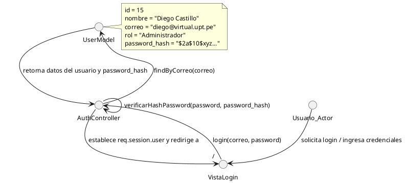
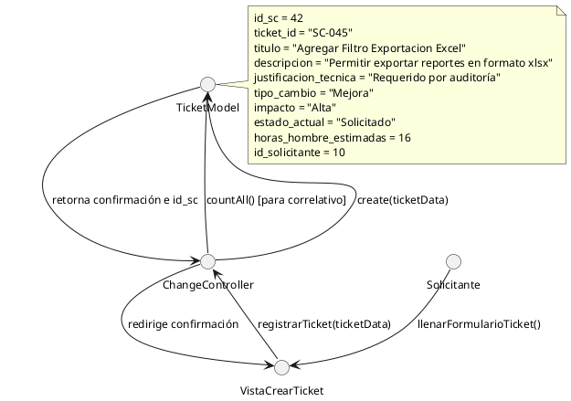
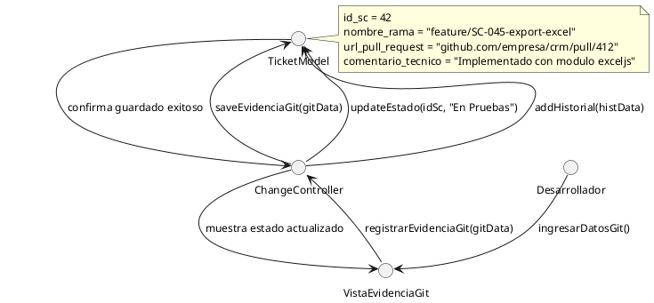
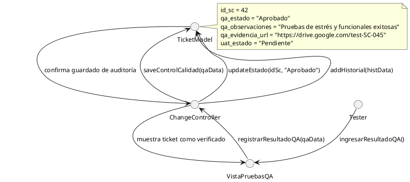

# Modelo Lógico - Diagramas de Colaboración de Objetos (Análisis)

El **Modelo Lógico de Análisis de Objetos** representa cómo interactúan las instancias del sistema mediante el envío de mensajes (métodos o flujos) para cumplir con un escenario específico de negocio de GestioCambios.

Cada objeto se representa mediante un **nodo circular (interfaz/objeto)** y se detallan sus atributos en notas y sus mensajes sobre las líneas de comunicación. Estos diagramas están adaptados 100% a la lógica de negocio y arquitectura funcional de nuestro sistema GestioCambios en fase de análisis.

Se presentan **4 diagramas de colaboración de objetos** correspondientes a los casos de uso principales.

---

## 1. Escenario 1: Autenticación de Usuario (Login)

Representa el flujo del sistema donde un usuario ingresa sus credenciales locales (correo y contraseña), las cuales son validadas contra el modelo de datos de la base de datos usando bcrypt para iniciar su sesión y redirigir según su rol.

### Código PlantUML

---

## 2. Escenario 2: Registro de Solicitud de Cambio (Creación de Ticket)

Representa el flujo en el cual el Solicitante crea un ticket formal de cambio con sus atributos de negocio (título, descripción, justificación técnica, impacto, tipo de cambio y estimación de horas hombre).

### Código PlantUML

---

## 3. Escenario 3: Integración de Código (Registro de Evidencia Git)

Representa la colaboración donde el Desarrollador asignado registra la rama de código y la URL del Pull Request de GitHub una vez terminado el desarrollo, cambiando el estado del ticket a "En Pruebas".

### Código PlantUML

---

## 4. Escenario 4: Evaluación de Calidad (Pruebas QA)

Representa el flujo de control de calidad donde el Tester registra el resultado del plan de pruebas (aprobado o rechazado) y observaciones, registrando la transición de estados en el historial.

### Código PlantUML

