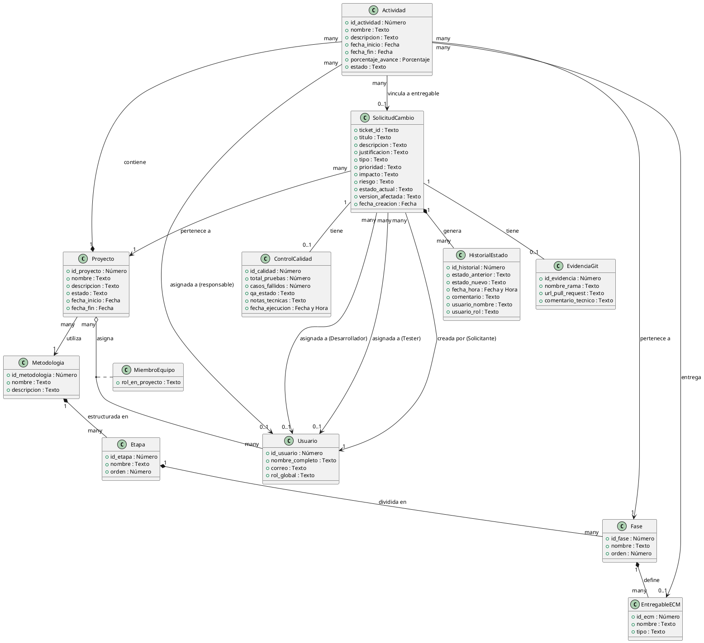

# Modelo de Dominio (Diagrama de Clases Conceptual) - GestioCambios

El Modelo de Dominio es un diagrama de clases conceptual que representa las entidades del mundo real en el espacio del problema de GestioCambios, detallando sus atributos en lenguaje de negocio y sus relaciones, sin incluir métodos, clases de diseño de software (como controladores, enrutadores o modelos ORM) o componentes de infraestructura técnica.

---

## 1. Guía de Lectura para el Cliente

Para facilitar la comprensión del diagrama sin necesidad de conocimientos técnicos de UML, tenga en cuenta las siguientes pautas:

* **Clases (Cajas):** Representan los conceptos o "cosas" importantes del negocio (ej. Proyecto, Usuario, Solicitud de Cambio). Cada caja contiene características de ese concepto (atributos).
* **Tipos de Datos Conceptuales:** Para evitar tecnicismos de programación, los atributos utilizan tipos de datos de negocio:
  * **Texto:** Nombres, descripciones, estados o comentarios.
  * **Número:** Identificadores únicos, contadores u ordenaciones.
  * **Fecha / Fecha y Hora:** Momentos en el tiempo en que ocurren los eventos.
  * **Porcentaje:** Valores proporcionales (ej. avance de tareas).
* **Líneas de Relación (Conexiones):** Indican cómo se conectan dos conceptos en el mundo real (ej. un Proyecto *contiene* Actividades).
* **Multiplicidades (Números en los extremos de las líneas):**
  * **"1"**: Exactamente uno.
  * **"0..1"**: Opcional (puede tener uno o ninguno).
  * **"many" o "*"**: Varios o muchos (desde cero hasta muchos).
  * *Ejemplo:* Una Solicitud de Cambio pertenece a **1** Proyecto, mientras que un Proyecto puede tener **many** (muchas) Solicitudes de Cambio.

---

## 2. Diagrama en PlantUML

---

## 3. Descripcion de las Clases Conceptuales

* **Proyecto:** Representa el esfuerzo temporal con fecha de inicio y fin para implementar una metodologia de control de configuracion.
* **Metodologia:** El marco metodologico de gestion de software (Scrum/RUP) que define las fases y los entregables esperados del proyecto.
* **Etapa, Fase y EntregableECM:** Elementos jerarquicos que estructuran la metodologia. El Elemento de Configuracion (ECM) representa el tipo de entregable a generar (ej. codigo, documento, diagrama).
* **Usuario y MiembroEquipo:** Representa los actores registrados. Un usuario tiene un rol global, pero adquiere un rol especifico (MiembroEquipo) y privilegios cuando es asignado a un proyecto.
* **Actividad:** Tarea especifica del cronograma del proyecto, asociada a una fase de la metodologia, con fechas y un miembro responsable asignado.
* **SolicitudCambio (Ticket):** La solicitud formal de modificacion realizada por un cliente, la cual atraviesa el workflow SCM.
* **HistorialEstado:** Registro de auditoria inalterable que detalla cada cambio de estado del ticket, el actor responsable, la fecha/hora y la justificacion.
* **EvidenciaGit:** Informacion de trazabilidad del repositorio (rama y Pull/Merge Request) agregada por el desarrollador asignado al ticket.
* **ControlCalidad:** Informe de resultados del plan de pruebas tecnicas ejecutado y registrado por el Tester responsable del control de calidad.

