# Modelo de Diseño - Diagrama de Clases de Diseño (SAD)

En la fase de diseño (SAD - Software Architecture Document), el **Diagrama de Clases de Diseño** detalla la implementación física en código de la aplicación. En lugar de modelar conceptos abstractos del negocio, este diagrama especifica las clases reales en Javascript (Controladores, Modelos DAO, Servicios y Conectores de base de datos) junto con sus atributos privados/públicos, métodos reales con firmas de argumentos y dependencias estructurales del proyecto.

---

## 1. Diagrama de Clases de Diseño en PlantUML

```plantuml
@startuml GestioCambios_Clases_Diseno

' CONFIGURACION GENERAL
skinparam defaultFontName Arial
skinparam defaultFontSize 11
skinparam classAttributeIconSize 0

' --- CONTROLADORES ---

class authController {
  + showLogin(req, res) : void
  + login(req, res) : void
  + logout(req, res) : void
  + requireAuth(req, res, next) : void
  + requireRole(...rolesPermitidos) : function
}

class changeController {
  + dashboard(req, res) : void
  + listarTickets(req, res) : void
  + mostrarTicket(req, res) : void
  + mostrarNuevoTicket(req, res) : void
  + crearTicket(req, res) : void
  + cambiarEstado(req, res) : void
  + apiListar(req, res) : void
  + apiDetalle(req, res) : void
}

class proyectoController {
  + miCartera(req, res) : void
  + detalleProyecto(req, res) : void
  + reportarAvance(req, res) : void
  + crearActividad(req, res) : void
  + actualizarActividad(req, res) : void
  + eliminarActividad(req, res) : void
  + verReportes(req, res) : void
}

class adminController {
  + dashboard(req, res) : void
  + listarUsuarios(req, res) : void
  + crearUsuario(req, res) : void
  + editarUsuario(req, res) : void
  + eliminarUsuario(req, res) : void
  + listarProyectos(req, res) : void
  + mostrarNuevoProyecto(req, res) : void
  + mostrarEditarFormProyecto(req, res) : void
  + crearProyecto(req, res) : void
  + mostrarEditarProyecto(req, res) : void
  + actualizarProyecto(req, res) : void
  + eliminarProyecto(req, res) : void
  + asignarMiembro(req, res) : void
  + quitarMiembro(req, res) : void
  + asignarCliente(req, res) : void
  + quitarCliente(req, res) : void
  + listarMetodologias(req, res) : void
  + crearMetodologia(req, res) : void
  + actualizarMetodologia(req, res) : void
  + eliminarMetodologia(req, res) : void
  + crearEtapa(req, res) : void
  + eliminarEtapa(req, res) : void
  + crearFase(req, res) : void
  + eliminarFase(req, res) : void
  + crearECM(req, res) : void
  + eliminarECM(req, res) : void
}

' --- MODELOS (CAPA DE ACCESO A DATOS) ---

class db {
  + query(sql : String, params : Array) : Promise
}

class UserModel {
  + findByCorreo(correo : String) : Promise<Object|null>
  + findById(id : Number) : Promise<Object|null>
  + findAll() : Promise<Array>
  + findActiveByRoles(rolesList : Array) : Promise<Array>
  + updatePasswordHash(id : Number, hash : String) : Promise<Boolean>
}

class TicketModel {
  + findAll(filtros : Object) : Promise<Array>
  + findById(ticketId : String) : Promise<Object|null>
  + countAll() : Promise<Number>
  + create(ticketData : Object) : Promise<Object>
  + updateEstado(idSc : Number, nuevoEstado : String) : Promise<Object>
  + updatePersonal(idSc : Number, idDev : Number, idTester : Number) : Promise<Object>
  + getHistorial(idSc : Number) : Promise<Array>
  + addHistorial(histData : Object) : Promise<Object>
  + getEcsAfectados(idSc : Number) : Promise<Array>
  + getEvidenciaGit(idSc : Number) : Promise<Object|null>
  + saveEvidenciaGit(gitData : Object) : Promise<Object>
  + getControlCalidad(idSc : Number) : Promise<Object|null>
  + saveControlCalidad(qaData : Object) : Promise<Object>
}

class ProyectoModel {
  + findAll(filtros : Object) : Promise<Array>
  + findByCliente(idUsuario : Number) : Promise<Array>
  + findByMiembro(idUsuario : Number) : Promise<Array>
  + findById(idProyecto : Number) : Promise<Object|null>
  + create(data : Object) : Promise<Object>
  + update(idProyecto : Number, data : Object) : Promise<Object>
  + delete(idProyecto : Number) : Promise<Object>
  + getEquipo(idProyecto : Number) : Promise<Array>
  + addMiembro(idProyecto : Number, idUsuario : Number, rol : String) : Promise<Object>
  + removeMiembro(idProyecto : Number, idUsuario : Number) : Promise<Object>
  + getClientes(idProyecto : Number) : Promise<Array>
  + addCliente(idProyecto : Number, idUsuario : Number) : Promise<Object>
  + removeCliente(idProyecto : Number, idUsuario : Number) : Promise<Object>
}

class CronogramaModel {
  + findByProyecto(idProyecto : Number) : Promise<Array>
  + findById(idActividad : Number) : Promise<Object|null>
  + create(data : Object) : Promise<Object>
  + update(idActividad : Number, data : Object) : Promise<Object>
  + delete(idActividad : Number) : Promise<Object>
  + syncAvanceConTicket(idSc : Number, estado : String, uId : Number, pId : Number) : Promise<Object>
}

class ReporteModel {
  + findByProyecto(idProyecto : Number, limit : Number) : Promise<Array>
  + findByActividad(idActividad : Number) : Promise<Array>
  + create(data : Object) : Promise<Object>
  + marcarVisto(idReporte : Number) : Promise<Object>
  + marcarTodosVistos(idProyecto : Number) : Promise<Object>
  + countNoVistos(idProyecto : Number) : Promise<Number>
  + getRanking(idProyecto : Number) : Promise<Array>
}

class MetodologiaModel {
  + findAll() : Promise<Array>
  + findById(idMetodologia : Number) : Promise<Object|null>
  + create(data : Object) : Promise<Object>
  + update(idMetodologia : Number, data : Object) : Promise<Object>
  + delete(idMetodologia : Number) : Promise<Object>
  + getEtapas(idMetodologia : Number) : Promise<Array>
  + createEtapa(data : Object) : Promise<Object>
  + updateEtapa(idEtapa : Number, data : Object) : Promise<Object>
  + deleteEtapa(idEtapa : Number) : Promise<Object>
  + getFases(idEtapa : Number) : Promise<Array>
  + createFase(data : Object) : Promise<Object>
  + updateFase(idFase : Number, data : Object) : Promise<Object>
  + deleteFase(idFase : Number) : Promise<Object>
  + getECMs(idFase : Number) : Promise<Array>
  + createECM(data : Object) : Promise<Object>
  + deleteECM(idEcm : Number) : Promise<Object>
}

' --- SERVICIOS ---

class WorkflowService {
  + isValidTransition(estadoActual : String, nuevoEstado : String, rol : String) : Boolean
}

' --- RELACIONES DE UTILIZACION / DEPENDENCIA ---

authController ..> UserModel : usa
authController ..> bcrypt : usa

changeController ..> TicketModel : usa
changeController ..> ProyectoModel : usa
changeController ..> CronogramaModel : usa
changeController ..> WorkflowService : usa

proyectoController ..> ProyectoModel : usa
proyectoController ..> CronogramaModel : usa
proyectoController ..> ReporteModel : usa

adminController ..> ProyectoModel : usa
adminController ..> UserModel : usa
adminController ..> MetodologiaModel : usa

' Los modelos heredan o se conectan a db
UserModel ..> db : realiza consultas
TicketModel ..> db : realiza consultas
ProyectoModel ..> db : realiza consultas
CronogramaModel ..> db : realiza consultas
ReporteModel ..> db : realiza consultas
MetodologiaModel ..> db : realiza consultas

@enduml
```

---

## 2. Descripción Técnica de las Capas

* **Capa de Controladores (Controllers):** Encapsula el procesamiento de peticiones HTTP (MVC/REST). Recibe parámetros en el body/query/params, efectúa validaciones de roles a través de sesión, orquesta las llamadas a los modelos de base de datos y responde redireccionando vistas `.ejs` o retornando respuestas serializadas en formato JSON.
* **Capa de Modelos (Data Access Object - DAO):** Aloja las consultas SQL parametrizadas para evitar inyecciones. Proporciona métodos asíncronos que devuelven Promesas Javascript, abstrayendo por completo el acceso a tablas físicas (`usuarios`, `solicitudes_cambio`, `evidencias_git`, `control_calidad`, `historial_estados`, `proyectos`, `proyecto_equipo`, `proyecto_clientes`, `metodologias`, `etapas`, `fases`, `ecs_afectados` y `reportes_avance`).
* **WorkflowService:** Servicio de validación de transiciones de estados del workflow SCM del ticket basado en el rol efectivo que tiene el usuario en dicho proyecto.
* **db (Conector):** Helper centralizado que ejecuta sentencias parametrizadas en la base de datos MySQL por medio de una piscina de conexiones persistente.
