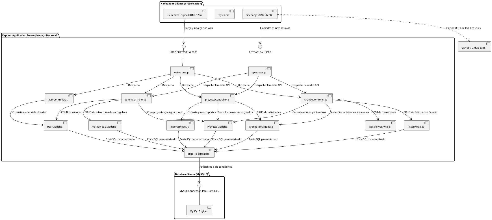

# Diagrama de Componentes - GestioCambios

El **Diagrama de Componentes** (Modelo C4 - Nivel 3) detalla la organización lógica de los módulos de software en tiempo de ejecución, sus interfaces de comunicación y la distribución de responsabilidades entre el frontend, el backend y la capa de almacenamiento en el servidor físico.

---

## 1. Diagrama en PlantUML

---

## 2. Especificación de Componentes e Interfaces

### Capa de Cliente (Presentación)
* **`EJS Render Engine (HTML/CSS)`:** Motor de plantillas que procesa y muestra la maquetación dinámica.
* **`styles.css`:** Contiene las reglas CSS globales de la interfaz del sistema.
* **`sidebar.js`:** Lógica de scripting cliente que maneja eventos asíncronos (AJAX) para transmitir actualizaciones en formato JSON de estados, asignaciones, Git y control de calidad.

### Capa del Servidor de Aplicación (Backend)
* **`webRoutes.js` y `apiRoutes.js`:** Enrutadores que dirigen las llamadas URL a las operaciones de controladores correspondientes.
* **Controladores (`authController`, `changeController`, `proyectoController` y `adminController`):** Orquestan el procesamiento de datos, validan perfiles de sesión y devuelven respuestas.
* **`WorkflowService.js`:** Servicio centralizado que evalúa la validez de los cambios de estado en base a la máquina de estados.
* **Capa de Modelos DAO (`UserModel`, `TicketModel`, `ProyectoModel`, `CronogramaModel`, `ReporteModel` y `MetodologiaModel`):** Abstraen el acceso a la base de datos implementando las funciones asíncronas de lectura y escritura.
* **`db.js`:** Utilidad pool que automatiza la conexión y desconexión con el socket relacional MySQL.

### Capa de Persistencia y Terceros
* **`MySQL Engine` (Puerto 3306):** Motor de base de datos relacional encargado de la consistencia e integridad de las tablas del sistema.
* **`GitHub / GitLab SaaS`:** Servidor externo de versionamiento referenciado lógicamente mediante enlaces URL en las solicitudes de cambio.
