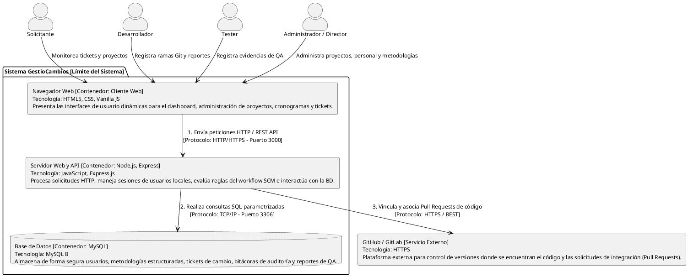

# Diagrama de Contenedores del Sistema - GestioCambios

El **Diagrama de Contenedores** (Modelo C4 - Nivel 2) detalla la arquitectura lógica de alto nivel de GestioCambios. Muestra los límites del sistema divididos en sus contenedores de ejecución (aplicación cliente, servidor de aplicación web y almacenamiento de base de datos), las tecnologías empleadas en cada uno, los protocolos de comunicación y su integración con sistemas externos.

---

## 1. Diagrama en PlantUML

---

## 2. Especificación Técnica de los Contenedores

* **Navegador Web (Cliente Web):**
  * **Tecnologías:** HTML5, CSS3, Javascript Vanilla (`sidebar.js`, etc.).
  * **Descripción:** Es la aplicación front-end que corre en el navegador del cliente. Proporciona la interfaz interactiva. Realiza llamadas asíncronas (AJAX) para el envío de evidencias y cambios de estado del ticket.
* **Servidor Web y API (Back-end):**
  * **Tecnologías:** Node.js, Express.js, bcryptjs, express-session.
  * **Descripción:** Es la aplicación de servidor en tiempo de ejecución. Sirve páginas pre-renderizadas con el motor EJS, procesa la autenticación local segura, administra las sesiones de usuario y expone una API REST. Ejecuta el core del workflow SCM (`WorkflowService`).
* **Base de Datos (Persistencia):**
  * **Tecnologías:** MySQL 8.
  * **Descripción:** Almacena de forma persistente y relacional toda la información estructurada del sistema.
* **GitHub / GitLab (Servicio Git Externo):**
  * **Tecnologías:** HTTPS API.
  * **Descripción:** Servidor externo de versionamiento. El backend almacena las URLs lógicas para garantizar la trazabilidad de los commits vinculados a un ticket SCM.
