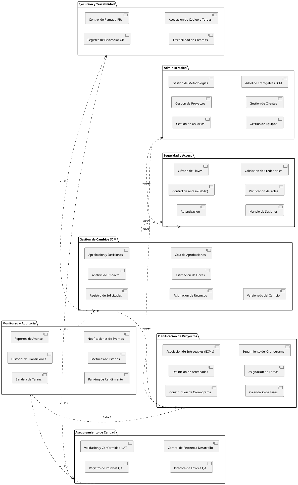

# Diagrama de Paquetes - GestioCambios

El diagrama de paquetes en la fase de analisis representa la estructura logica y conceptual de los dominios funcionales del sistema, mostrando como se agrupan los requisitos del negocio en modulos independientes, todos los sub-componentes (nodos funcionales) que integran cada modulo, y las dependencias de servicio entre ellos.

---

## 1. Diagrama en PlantUML

---

## 2. Descripcion Detallada de los Paquetes y Nodos Funcionales

### Seguridad y Acceso
Modulo encargado de la proteccion y validacion de identidad de la plataforma.
* **Autenticacion:** Inicio y cierre de sesion.
* **Control de Acceso (RBAC):** Politica de control basada en roles para restringir rutas.
* **Cifrado de Claves:** Hasheo unidireccional de contrasenas.
* **Manejo de Sesiones:** Mantenimiento del estado del usuario durante 8 horas.
* **Verificacion de Roles:** Evaluacion de permisos especificos del usuario.
* **Validacion de Credenciales:** Verificacion de sintaxis e integridad de correos y contrasenas.

### Administracion
Encargado de la estructura organizativa inicial y los datos maestros del sistema.
* **Gestion de Usuarios:** Creacion, edicion e inhabilitacion de cuentas globales.
* **Gestion de Proyectos:** Registro de los proyectos en ejecucion.
* **Gestion de Metodologias:** Estructura de marcos de trabajo (RUP/Scrum).
* **Gestion de Equipos:** Registro de personal tecnico asignado a proyectos.
* **Gestion de Clientes:** Asignacion de solicitantes validos por proyecto.
* **Arbol de Entregables SCM:** Estructuracion de la relacion Etapas > Fases > ECMs.

### Planificacion de Proyectos
Modulo de calendarizacion y planificacion temporal de tareas.
* **Construccion de Cronograma:** CRUD de actividades del proyecto.
* **Definicion de Actividades:** Parametrizacion de nombres y descripciones de tareas.
* **Asociacion de Entregables (ECMs):** Vinculo de actividades con entregables metodologicos.
* **Calendario de Fases:** Fechas limite de inicio y fin por fase de trabajo.
* **Asignacion de Tareas:** Designacion del responsable tecnico de cada actividad.
* **Seguimiento del Cronograma:** Calculo automatico del porcentaje de avance.

### Gestion de Cambios SCM
Nucleo que administra el ciclo de vida de las solicitudes de cambio (Tickets).
* **Registro de Solicitudes:** Creacion de tickets por Solicitantes o Miembros del equipo.
* **Analisis de Impacto:** Evaluacion tecnica de viabilidad y criticidad del cambio.
* **Aprobacion y Decisiones:** Resolucion de aprobacion formal por Director o CCB.
* **Asignacion de Recursos:** Asignacion de Desarrollador y Tester para tickets aprobados.
* **Estimacion de Horas:** Calculo de esfuerzo en horas-hombre de desarrollo.
* **Cola de Aprobaciones:** Bandeja de autorizacion formal de solicitudes de cambio.
* **Versionado del Cambio:** Asignacion de version final del cambio en el analisis.

### Ejecucion y Trazabilidad
Modulo operativo donde el desarrollador realiza la modificacion del software.
* **Registro de Evidencias Git:** Formulario de registro de ramas de repositorio.
* **Control de Ramas y PRs:** Enlace a URLs de Pull Requests del servidor de Git.
* **Trazabilidad de Commits:** Vinculo de codigo fuente al ID del ticket.
* **Asociacion de Codigo a Tareas:** Union del avance en Git con las actividades del cronograma.

### Aseguramiento de Calidad (QA/UAT)
Modulo encargado de verificar que los cambios cumplan con los estandares definidos.
* **Registro de Pruebas QA:** Registro de casos de prueba ejecutados y observaciones.
* **Validacion y Conformidad UAT:** Firma de aceptacion de usuario final (Solicitante).
* **Bitacora de Errores QA:** Registro y notas de incidencias encontradas.
* **Control de Retorno a Desarrollo:** Derivacion automatica de tickets fallidos a desarrollo.

### Monitoreo y Auditoria
Paquete encargado del control, seguimiento global y resguardo de la informacion.
* **Bandeja de Tareas:** Lista personalizada de pendientes segun el rol del usuario.
* **Historial de Transiciones:** Registro inmutable de auditoria de los cambios de estado.
* **Reportes de Avance:** Bitacora de reportes de avance diario del cronograma.
* **Ranking de Rendimiento:** Tabla de medallas segun tareas completadas.
* **Metricas de Estados:** Graficos estadisticos del estado de los tickets.
* **Notificaciones de Eventos:** Campana de notificaciones de tickets solicitados.
