# Modelo de Diseño - Diagrama de Paquetes de Diseño (SAD)

En la fase de diseño (SAD - Software Architecture Document), el **Diagrama de Paquetes de Diseño** representa de forma literal la estructura de directorios y la organización de carpetas de la aplicación de GestioCambios. Muestra la totalidad de carpetas físicas del código del proyecto (excluyendo la documentación y el control de versiones local), los componentes alojados en ellas y las dependencias de importación e integración entre estos paquetes.

---

## 1. Diagrama de Carpetas del Proyecto en PlantUML

```plantuml
@startuml GestioCambios_Directorios_SAD
skinparam defaultFontName Arial
skinparam defaultFontSize 11
skinparam packageStyle rectangle

' Carpeta Raíz del Proyecto
package "Gestion_de_Cambios [Raíz del Proyecto]" as P_Root {
  
  [server.js]
  [package.json]
  [seed.js]
  [base de datos.sql]
  [hash-passwords.js]

  ' 1. Subcarpeta public (Recursos estáticos expuestos al navegador)
  package "public [Archivos Estáticos]" as P_Public {
    package "css" {
      [styles.css]
    }
    package "js" {
      [sidebar.js]
    }
  }

  ' 2. Subcarpeta views (Plantillas de Presentación EJS)
  package "views [Vistas del Navegador]" as P_Views {
    [login.ejs]
    [dashboard.ejs]
    [nuevo-ticket.ejs]
    [ticket-detail.ejs]
    [cartera.ejs]
    [reportes-avance.ejs]
    [tickets.ejs]
    [error.ejs]
    
    package "admin [Paneles de Control]" {
      [usuarios.ejs]
      [proyectos.ejs]
      [proyecto-config.ejs]
      [metodologias.ejs]
      [proyecto-form.ejs]
    }
    package "partials [Librerías de Bloques UI]" {
      [head.ejs]
      [sidebar.ejs]
      [footer.ejs]
    }
  }

  ' 3. Subcarpeta routes (Enrutamiento HTTP)
  package "routes [Enrutadores Express]" as P_Routes {
    [webRoutes.js]
    [apiRoutes.js]
  }

  ' 4. Subcarpeta controllers (Lógica de Orquestación)
  package "controllers [Controladores MVC]" as P_Controllers {
    [authController.js]
    [changeController.js]
    [proyectoController.js]
    [adminController.js]
  }

  ' 5. Subcarpeta models (Persistencia y queries relacionales)
  package "models [Modelos de Acceso a Datos]" as P_Models {
    [UserModel.js]
    [TicketModel.js]
    [ProyectoModel.js]
    [CronogramaModel.js]
    [ReporteModel.js]
    [MetodologiaModel.js]
  }

  ' 6. Subcarpeta services (Lógica del Negocio)
  package "services [Validadores de Dominio]" as P_Services {
    [WorkflowService.js]
  }

  ' 7. Subcarpeta config (Piscina de conexiones y constantes)
  package "config [Configuraciones]" as P_Config {
    [db.js]
    [db-init.js]
    [constants.js]
  }

  ' 8. Subcarpeta scratch (Generación y scripts semilla)
  package "scratch [Utilitarios de Desarrollo]" as P_Scratch {
    [generate_doc.js]
  }

  ' 9. Subcarpeta node_modules (Librerías externas instaladas)
  package "node_modules [Dependencias NPM]" as P_NodeModules {
    [express]
    [mysql2]
    [bcryptjs]
    [ejs]
    [express-session]
    [docx]
  }
}

' --- DEPENDENCIAS E IMPORTACIONES DE CÓDIGO (REQUIRE Y ENLACES) ---

[server.js] --> P_Routes : "importa y expone rutas"
[server.js] --> P_Config : "importa db.js para test connection"
[server.js] --> P_NodeModules : "requiere dependencias npm (express, ejs, express-session)"

P_Routes --> P_Controllers : "direcciona URLs a controladores"
P_Controllers --> P_Models : "realiza operaciones CRUD"
P_Controllers --> P_Services : "valida transiciones del workflow"
P_Controllers --> P_NodeModules : "encripta claves con bcryptjs"
P_Controllers --> P_Config : "lee ROLES y ESTADOS de constants.js"

P_Models --> P_Config : "ejecuta SQL parametrizado vía db.js"
P_Models --> P_NodeModules : "importa mysql2 para promesas pool"

P_Views ..> P_Public : "incluye archivos estáticos (styles.css, sidebar.js)"
P_Scratch --> P_NodeModules : "compila especificaciones usando docx"

@enduml
```

---

## 2. Especificación Arquitectónica de las Carpetas del Proyecto

* **`public/` (Recursos Estáticos):** Contiene las hojas de estilo [styles.css](file:///c:/Users/ASUS/Music/GESTION_PROYECTO/Gestion_de_Cambios/public/css/styles.css) y los controladores asíncronos del cliente como [sidebar.js](file:///c:/Users/ASUS/Music/GESTION_PROYECTO/Gestion_de_Cambios/public/js/sidebar.js). Estos archivos son leídos por el navegador web del usuario final para renderizar la página y ejecutar llamadas AJAX.
* **`views/` (Vistas):** Almacena las plantillas dinámicas EJS. La carpeta `admin/` contiene interfaces para los privilegios administrativos, y `partials/` almacena cabeceras, pies de página y barras laterales unificadas.
* **`routes/` (Enrutamiento):** Mapea los endpoints HTTP y asocia las URLs con las funciones controladoras.
* **`controllers/` (Controladores):** Contiene la lógica del servidor que lee las peticiones, valida sesiones y despacha comandos.
* **`models/` (Capa de Acceso a Datos):** Encapsula todas las operaciones e interacciones CRUD con la base de datos MySQL.
* **`services/` (Lógica de Dominio):** Implementa verificaciones y reglas de negocio puras.
* **`config/` (Configuración):** Centraliza la inicialización de la piscina de conexiones pool (`db.js`) y las constantes funcionales (`constants.js`).
* **`scratch/` (Utilitarios):** Contiene los scripts auxiliares de desarrollo, como [generate_doc.js](file:///c:/Users/ASUS/Music/GESTION_PROYECTO/Gestion_de_Cambios/scratch/generate_doc.js) para la compilación del reporte de especificación de casos de uso.
* **`node_modules/` (Dependencias):** Directorio de módulos externos administrados por NPM necesarios para ejecutar el servidor.
