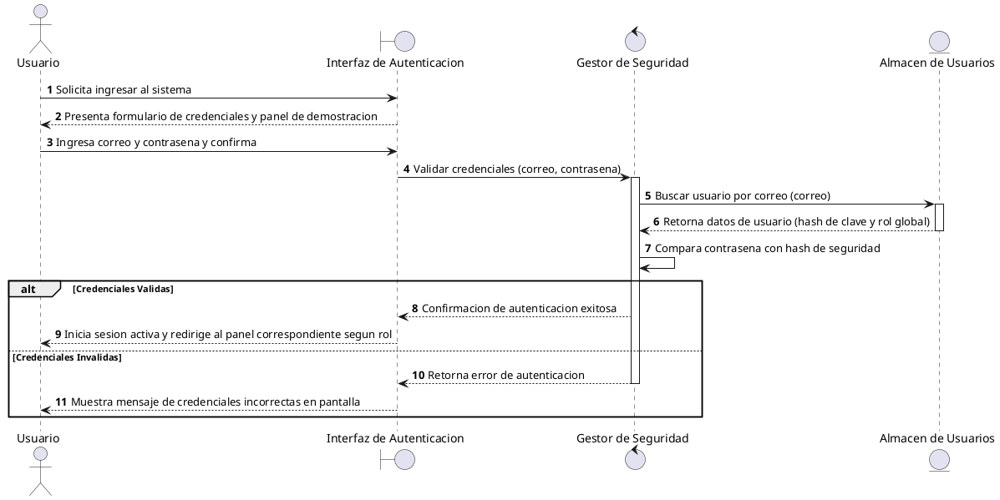
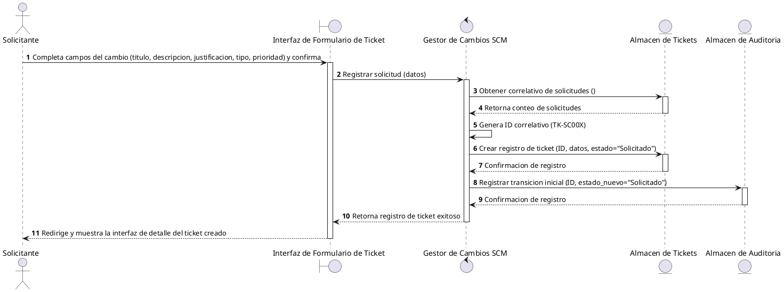
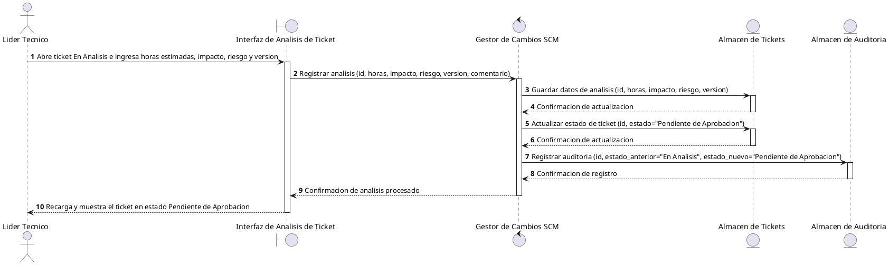
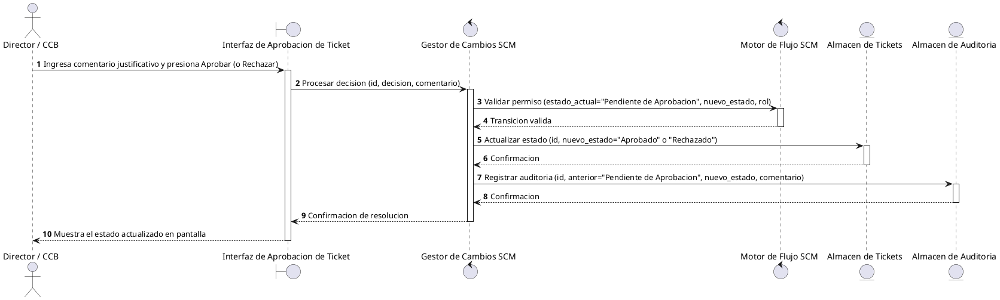
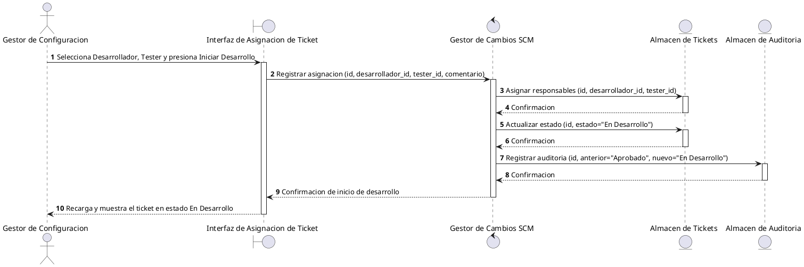
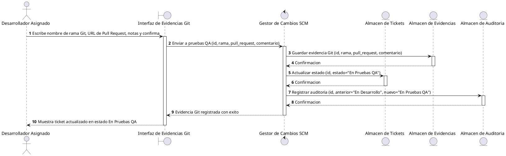
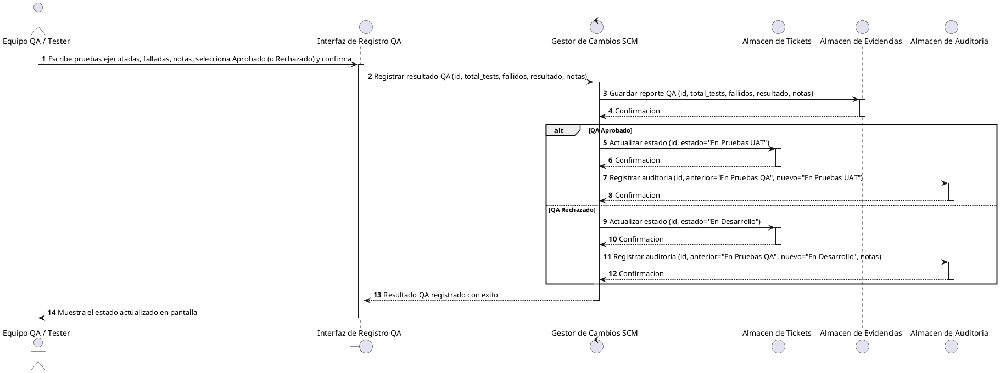
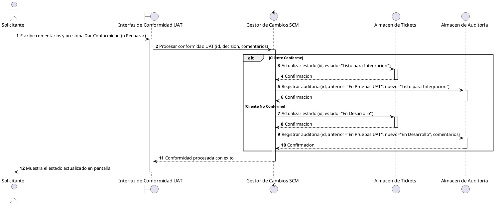
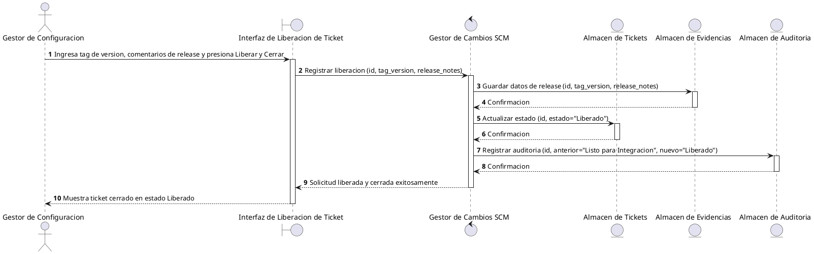

# Diagramas de Secuencia del Sistema (Fase de Analisis) - GestioCambios

Este documento presenta los Diagramas de Secuencia del Sistema (SSD) detallados para cada uno de los casos de uso criticos del ciclo de vida de control de cambios, utilizando el patron conceptual **BCE (Boundary-Control-Entity / Frontera-Control-Entidad)**. 

Al separar cada accion en su propio diagrama, el cliente puede visualizar la participacion exacta de cada actor (Usuario, Solicitante, Director, Lider Tecnico, CCB, Gestor, Desarrollador y Tester) y la interfaz especifica involucrada.

---

## 1. Iniciar Sesion (UC-001)
* **Actor:** Usuario General (todos los roles)
* **Interfaz:** Interfaz de Autenticacion
* **Proceso:** Validacion y autorizacion de sesion global.

---

## 2. Registrar Solicitud de Cambio (UC-010)
* **Actor:** Solicitante
* **Interfaz:** Interfaz de Formulario de Ticket
* **Proceso:** Creacion inicial de la peticion en el sistema.

---

## 3. Realizar Analisis de Impacto (UC-011)
* **Actor:** Lider Tecnico
* **Interfaz:** Interfaz de Analisis de Ticket
* **Proceso:** Estimacion de esfuerzo y evaluacion tecnica del cambio.

---

## 4. Aprobar o Rechazar Solicitud (UC-012)
* **Actor:** Director / CCB
* **Interfaz:** Interfaz de Aprobacion de Ticket
* **Proceso:** Resolucion y autorizacion formal del cambio analizado.

---

## 5. Asignar Desarrollador y Tester (UC-013)
* **Actor:** Gestor de Configuracion
* **Interfaz:** Interfaz de Asignacion de Ticket
* **Proceso:** Designacion de personal tecnico para la solucion.

---

## 6. Registrar Evidencias Git (UC-014)
* **Actor:** Desarrollador Asignado
* **Interfaz:** Interfaz de Evidencias Git
* **Proceso:** Registro de la rama y Pull/Merge Request de la solucion.

---

## 7. Registrar Pruebas QA (UC-015)
* **Actor:** Equipo QA / Tester
* **Interfaz:** Interfaz de Registro QA
* **Proceso:** Carga de resultados de ejecucion del plan de pruebas.

---

## 8. Validar en ambiente UAT (UC-016)
* **Actor:** Solicitante
* **Interfaz:** Interfaz de Conformidad UAT
* **Proceso:** Prueba de aceptacion del usuario final.

---

## 9. Integrar y Liberar Cambio (UC-017)
* **Actor:** Gestor de Configuracion
* **Interfaz:** Interfaz de Liberacion de Ticket
* **Proceso:** Merge en produccion, etiquetado de version y cierre del flujo.

