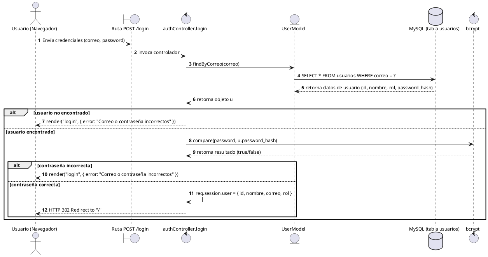
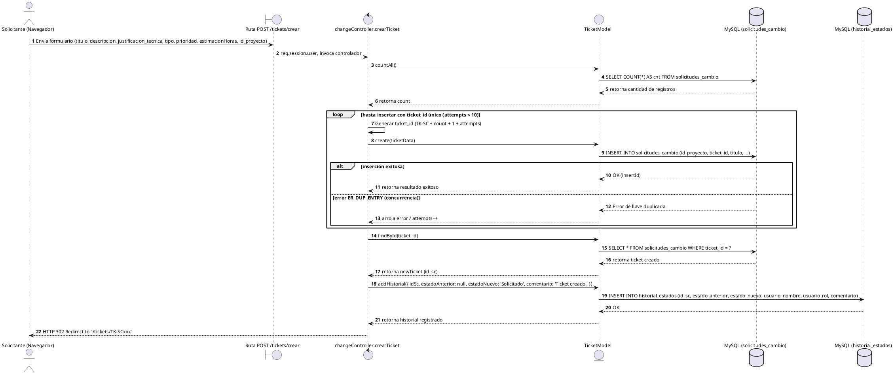
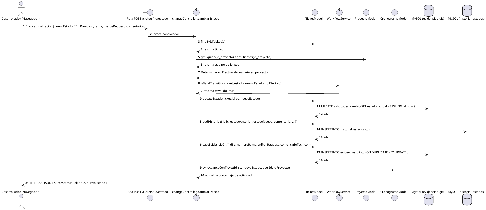
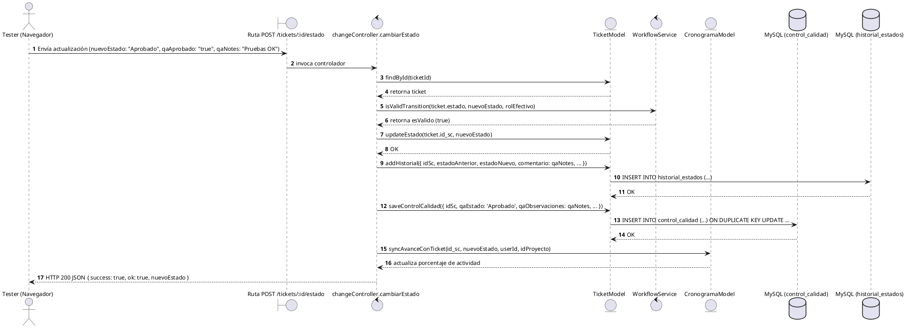

# Documento de Diseño de Software (SAD) - Diagramas de Secuencia de Diseño

En la fase de diseño (SAD - Software Architecture Document), los **Diagramas de Secuencia de Diseño** detallan los componentes técnicos reales de la arquitectura de software. A diferencia de los diagramas conceptuales de análisis, estos diagramas muestran enrutadores HTTP, controladores, servicios auxiliares de encriptación y validación, modelos de acceso a datos (ORM/ActiveRecord), sentencias SQL y cambios en el estado de la base de datos física.

A continuación, se presentan **4 diagramas de secuencia técnicos** correspondientes a los flujos clave del backend de GestioCambios.

---

## 1. Flujo de Autenticación de Usuario (Login)

Representa la verificación técnica de credenciales contra la base de datos MySQL, el hashing seguro mediante `bcrypt` y el establecimiento de la sesión.

### Código PlantUML

---

## 2. Creación de Solicitud de Cambio (Ticket SCM)

Muestra la lógica de concurrencia para generar un `ticket_id` único sin colisiones, la inserción física en MySQL, y la creación automática del registro inicial de auditoría.

### Código PlantUML

---

## 3. Registro de Evidencia de Código (Asociación de Rama Git)

Representa el flujo de integración técnica en el cual un desarrollador asocia su rama de desarrollo y PR de GitHub. Involucra la validación de transiciones en `WorkflowService` y la sincronización con el cronograma.

### Código PlantUML

---

## 4. Registro de Pruebas y Cierre de Control de Calidad (QA/UAT)

Detalla cómo el rol Tester asienta las pruebas funcionales en la base de datos a través del controlador de negocio, persistiendo los datos de QA y actualizando el workflow hacia un estado validado.

### Código PlantUML

